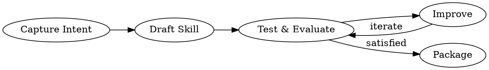

# Skill Creator

Create and iteratively improve Claude Code skills.

## Core Loop



**Your job:** Figure out where the user is in this process and help them progress.

---

## Communicating with the user

The skill creator is used by people across a wide range of familiarity with coding jargon. Pay attention to context cues:

- "evaluation" and "benchmark" are borderline, but OK
- For "JSON" and "assertion", see serious cues from the user that they know what those things are before using them without explaining

It's OK to briefly explain terms if you're in doubt.

---

## Creating a Skill

### 1. Capture Intent

Extract from conversation or ask:
1. What should this skill enable Claude to do?
2. When should it trigger? (user phrases/contexts)
3. Expected output format?
4. Need test cases? (objective outputs = yes; subjective = usually no)

### 2. Write SKILL.md

**Frontmatter:**
```yaml
---
name: skill-name-with-hyphens
description: Use when [specific triggers]. Include symptoms, contexts, user phrases.
---
```

**Structure:**
```
skill-name/
├── SKILL.md           # Main file (<500 lines)
└── references/        # Large docs loaded as needed
```

**Progressive disclosure:**
1. Metadata (name + description) — always in context
2. SKILL.md body — in context when triggered
3. Bundled resources — loaded as needed

**Writing style:**
- Explain WHY, not just WHAT
- Use imperative form
- One good example > many mediocre ones
- Keep under 500 lines; split large content to references/

### 3. Test Cases

Create 2-3 realistic prompts in `evals/evals.json`:
```json
{
  "skill_name": "example-skill",
  "evals": [
    {"id": 1, "prompt": "User's task", "expected_output": "Description", "files": []}
  ]
}
```

---

## Running & Evaluating Tests

**This section is one continuous sequence — don't stop partway through.**

### Step 1: Spawn runs (with-skill AND baseline together)

For each test case, spawn two subagents in parallel:
- **With-skill:** Skill path + task + save to `with_skill/outputs/`
- **Baseline:** No skill (new) or old version (improving) → `without_skill/` or `old_skill/`

Results go in `<skill-name>-workspace/iteration-N/eval-name/`.

### Step 2: Draft assertions while running

Good assertions are objectively verifiable with descriptive names. Update `eval_metadata.json` and `evals/evals.json`.

### Step 3: Capture timing data

When each subagent completes, save to `timing.json`:
```json
{"total_tokens": 84852, "duration_ms": 23332, "total_duration_seconds": 23.3}
```

### Step 4: Grade, aggregate, launch viewer

1. **Grade** each run → `grading.json` (use `text`, `passed`, `evidence` fields)
2. **Aggregate:** `python -m scripts.aggregate_benchmark <workspace>/iteration-N --skill-name <name>`
3. **Analyze:** See `agents/analyzer.md` for patterns to look for
4. **Launch viewer:**
   ```bash
   nohup python <skill-creator-path>/eval-viewer/generate_review.py \
     <workspace>/iteration-N --skill-name "my-skill" \
     --benchmark <workspace>/iteration-N/benchmark.json \
     > /dev/null 2>&1 &
   ```

### Step 5: Read feedback

When user is done, read `feedback.json`. Empty feedback = fine. Focus improvements on cases with specific complaints.

---

## Improving the Skill

### How to think

1. **Generalize from feedback.** Don't overfit to test cases. Try different metaphors/patterns.
2. **Keep lean.** Remove things not pulling their weight.
3. **Explain WHY.** Let the model understand the reasoning.
4. **Bundle repeated work.** If subagents write the same helper script, put it in `scripts/`.

### Iteration loop

1. Apply improvements
2. Rerun into new `iteration-N+1/` directory
3. Launch viewer with `--previous-workspace`
4. Wait for feedback, repeat

Stop when: user happy, all feedback empty, or not making progress.

---

## Description Optimization

After skill is done, optimize the description for triggering accuracy.

**Process:** Generate 20 queries (10 trigger, 10 no-trigger) → Review with user → Run optimization loop → Apply best description

**See:** `references/description-optimization.md` for full details.

---

## Reference Files

| File | Purpose |
|------|---------|
| `references/description-optimization.md` | Full description optimization guide |
| `references/platform-specific.md` | Claude.ai and Cowork adaptations |
| `references/blind-comparison.md` | Rigorous A/B comparison |
| `agents/grader.md` | How to evaluate assertions |
| `agents/comparator.md` | Blind A/B comparison |
| `agents/analyzer.md` | Analyzing benchmark results |
| `references/schemas.md` | JSON structures |

---

## Platform Notes

- **Claude.ai:** No subagents → run tests yourself, skip baselines, skip browser viewer
- **Cowork:** Subagents work, use `--static` for viewer, always generate viewer before evaluating

**See:** `references/platform-specific.md` for details.

---

## Package & Present

If `present_files` tool available:
```bash
python -m scripts.package_skill <path/to/skill-folder>
```
Then direct user to the `.skill` file.

---

**Core loop reminder:** Capture → Draft → Test → Improve → Repeat → Package
