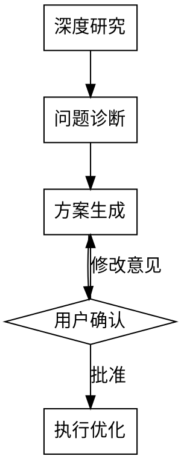

# Instruction Optimizer

深度分析并优化 Claude Code 指令文档（SKILL.md、CLAUDE.md、Agent、Rules、Commands）。

**核心原则：先深度研究，再提出方案，最后用户批准**

## 支持的目标类型

| 类型 | 路径 | 特点 |
|------|------|------|
| **Skill** | `~/.claude/skills/<name>/SKILL.md` | 有 description，按需加载，可引用文件 |
| **CLAUDE.md** | 项目根目录或 `~/.claude/CLAUDE.md` | 无 description，频繁加载 |
| **Agent** | `~/.claude/agents/<name>.md` | 有 model/tools 限制，子代理角色 |
| **Rules** | `.claude/rules/<name>.md` | 可选 paths 字段，路径范围限定 |
| **Commands** | `.claude/commands/<name>.md` | 有 description，支持 !`cmd` 和 $ARGUMENTS |

## 工作流程



## Phase 1: 深度研究

**目标：全面理解目标文档**

1. **识别目标类型**
   - Skill：有 YAML frontmatter，包含 `name` 和 `description`，位于 `skills/` 目录
   - CLAUDE.md：无 frontmatter，纯 Markdown 指令，位于项目根目录
   - Agent：有 YAML frontmatter，包含 `model` 和 `tools` 字段
   - Rules：可选 YAML frontmatter，可能包含 `paths` 字段，位于 `.claude/rules/`
   - Commands：有 YAML frontmatter，包含 `description`，可能含 `argument-hint`

2. **读取目标文档**
   - 读取主文件及所有引用文件
   - 记录文件结构和内容长度

3. **分析当前状态**
   ```
   | 维度 | 当前值 | 备注 |
   |------|--------|------|
   | 类型 | Skill/CLAUDE.md | |
   | 总行数 | X 行 | 主文件 |
   | 引用文件 | X 个 | scripts/references 等 |
   | description 长度 | X 字符 | 仅 Skill |
   ```

4. **理解文档用途**
   - 解决什么问题？
   - 目标用户是谁？
   - 加载频率？（频繁加载 vs 按需加载）

## Phase 2: 问题诊断

**从四个维度诊断问题：**

### 2.1 触发准确性

**适用于：Skill, Commands**

- [ ] description 是否准确描述触发条件？
- [ ] 是否包含具体症状/场景关键词？
- [ ] 是否存在"应该触发但没触发"的场景？
- [ ] 是否存在"不该触发但触发了"的场景？

**适用于：Rules**

- [ ] paths 字段是否精确匹配目标文件？
- [ ] 是否存在路径过于宽泛的问题？
- [ ] 无 paths 的规则是否足够精简？

**常见问题：**
- 描述过于抽象
- 缺少症状关键词
- 过度总结流程
- 路径匹配过宽（Rules）

### 2.2 Token 效率

- [ ] 是否有重复内容？
- [ ] 是否有冗长的示例可以精简？
- [ ] 是否有大段内容可以拆分到引用文件？
- [ ] 流程图是否必要？
- [ ] 表格是否比文字更高效？

**Token 目标：**
| 文档类型 | 目标行数 | 目标词数 | 备注 |
|----------|----------|----------|------|
| CLAUDE.md | <100 行 | <500 词 | 每次会话加载 |
| Skill 主文件 | <200 行 | <1000 词 | 按需加载 |
| Agent | <150 行 | <800 词 | 独立上下文 |
| Rules (有 paths) | <100 行 | <500 词 | 匹配时加载 |
| Rules (无 paths) | <50 行 | <250 词 | 每次会话加载 |
| Commands | <100 行 | <500 词 | 手动调用 |
| 引用文件 | 不限 | 按需 | 仅 Skill 支持 |

### 2.3 指令清晰度

- [ ] MUST/ALWAYS/NEVER 是否过多？（过多 = 信号稀释）
- [ ] 是否有歧义表述？
- [ ] 是否需要具体示例说明边界情况？
- [ ] 指令的"为什么"是否解释清楚？
- [ ] 是否有相互矛盾的指令？

### 2.4 结构优化

- [ ] 章节组织是否逻辑清晰？
- [ ] 是否有流程图辅助复杂决策？
- [ ] 是否有快速参考表格？
- [ ] 引用文件是否按需加载？

## Phase 3: 方案生成

**输出格式：**

```markdown
# 优化方案：[文档名称]

## 诊断摘要
- 类型：Skill / CLAUDE.md
- 总行数：X → 目标 Y
- 主要问题：[2-3 个核心问题]

## 优化建议

### 确定优化（无需确认）
| # | 维度 | 问题 | 优化方案 | 预期效果 |
|---|------|------|----------|----------|
| 1 | Token | XX | XX | -50 行 |

### 需要确认的优化
| # | 维度 | 问题 | 优化方案 | 不确定原因 |
|---|------|------|----------|------------|
| 2 | 触发 | XX | XX | 可能影响现有行为 |
```

## Phase 4: 用户确认

**向用户提问不确定的优化点：**

```
关于优化建议 #2：
- 问题：[描述问题]
- 方案：[优化方案]
- 问题：你更倾向于 A 还是 B？
```

## Phase 5: 执行优化

**用户批准后执行：**

1. **备份原文件**
   ```bash
   cp <file> <file>.bak
   ```

2. **应用优化**
   - 按优先级顺序执行
   - 保持格式规范
   - 验证 frontmatter 正确性（仅 Skill）

3. **验证结果**
   - 检查语法正确
   - 确认无遗漏内容
   - 对比前后变化

4. **输出总结**
   ```
   ✅ 优化完成

   | 指标 | 优化前 | 优化后 | 变化 |
   |------|--------|--------|------|
   | 行数 | X | Y | -Z |

   主要改进：
   1. ...
   2. ...
   ```

## CLAUDE.md 特殊考虑

### 与 Skill 的区别

| 特性 | Skill | CLAUDE.md | Agent | Rules | Commands |
|------|-------|-----------|-------|-------|----------|
| 加载时机 | 按需触发 | 每次会话 | 作为子代理 | 文件匹配时 | 手动调用 |
| Token 预算 | 较宽松 | 极度严格 | 独立上下文 | 按路径加载 | 按需 |
| 触发机制 | description | 自动加载 | 主代理调度 | paths 匹配 | /命令名 |
| 引用文件 | 支持 | 支持 | 支持 | 不支持 | 不支持 |

### CLAUDE.md 优化重点

1. **极致精简**：目标 <100 行，<500 词
2. **核心优先**：最重要规则放在最前面
3. **拆分到引用**：大段内容用 `@file` 引用
4. **避免重复**：不要与全局 CLAUDE.md 重复

### CLAUDE.md 常见结构

```markdown
# 项目名

一句话描述项目

## 常用命令
[仅列出最常用的 3-5 个]

## 架构/约定
[核心约定，不超过 5 条]

## 注意事项
[容易出错的地方]

## 详细文档
[引用文件列表]
- @docs/api.md
- @docs/testing.md
```

## Agent 特殊考虑

### Agent 文件结构

```yaml
---
name: agent-name
description: Use when... [触发条件]
model: sonnet | haiku | opus
tools: Read, Grep, Glob  # 可选：限制工具
---

# Agent 角色定义

[系统提示词内容]
```

### Agent 优化重点

1. **角色定位清晰**
   - 一句话说明这个 agent 是谁
   - 明确与主代理的区别

2. **工具限制合理**
   - 只读任务：限制为 `Read, Grep, Glob`
   - 写入任务：添加 `Write, Edit`
   - 避免：给不需要的工具权限

3. **Model 选择**
   - `haiku`：简单只读任务（快速、便宜）
   - `sonnet`：平衡任务（默认）
   - `opus`：复杂推理任务

4. **输出规范**
   - 明确输出格式要求
   - 指定压缩/汇总方式
   - 避免主代理上下文污染

### Agent 常见问题

| 问题 | 症状 | 修复方案 |
|------|------|----------|
| 角色不清 | 输出与主代理重复 | 明确"你是 X 专家，只做 Y" |
| 工具过多 | 越权操作 | 限制 tools 字段 |
| 输出冗长 | 污染主上下文 | 添加"输出压缩摘要"指令 |
| model 不匹配 | 任务失败或成本高 | 根据 task 复杂度调整 |

## Rules 特殊考虑

### Rules 文件结构

```yaml
---
paths:
  - "src/api/**/*.ts"
  - "src/handlers/**/*.ts"
---

# 规则内容
[针对匹配路径的指令]
```

### Rules 优化重点

1. **路径范围精确**
   - 使用 glob 模式限定适用范围
   - 避免过于宽泛的匹配（如 `**/*.ts`）
   - 多个路径用列表形式

2. **职责单一**
   - 每个 rule 文件只关注一个领域
   - 命名应反映内容（如 `api-conventions.md`）
   - 无 paths 的 rules 会在每次会话加载，需精简

3. **按需加载原则**
   - 有 paths 的规则仅在匹配时加载
   - 无 paths 的规则保持极简（<50 行）
   - 避免与其他 rules 内容重复

### Rules 常见问题

| 问题 | 症状 | 修复方案 |
|------|------|----------|
| 路径过宽 | 不相关文件触发规则 | 收窄 glob 模式 |
| 无 paths 且过长 | 每次 token 浪费 | 添加 paths 或拆分 |
| 内容重复 | 与 CLAUDE.md 冲突 | 移至 rules 或保留一处 |

## Commands 特殊考虑

### Commands 文件结构

```yaml
---
description: 简短描述命令用途
argument-hint: [参数说明]  # 可选
---

## 命令内容

支持动态内容：
- !`shell command` — 执行 shell 并嵌入输出
- $ARGUMENTS — 用户传入的参数
```

### Commands 优化重点

1. **description 清晰**
   - 说明命令做什么，不是怎么做
   - 包含触发场景关键词

2. **动态内容高效**
   - !`cmd` 输出可能很长，考虑限制
   - 使用 `| head -20` 等截断
   - 只嵌入必要信息

3. **参数使用合理**
   - $ARGUMENTS 替换位置明确
   - 提供 argument-hint 指导用户

### Commands 常见问题

| 问题 | 症状 | 修复方案 |
|------|------|----------|
| shell 输出过长 | token 浪费 | 添加 `| head` 截断 |
| description 模糊 | 用户不知道何时用 | 添加触发场景 |
| 参数位置不清 | 调用失败 | 添加 argument-hint |

## 注意事项

- **不改变核心行为**：优化是改进表达方式，不是改变功能
- **保留用户偏好**：如果原文档有特定风格，询问是否保留
- **渐进式优化**：大改动分多次小改动，便于回滚
- **记录变更**：优化后简要记录改动内容
